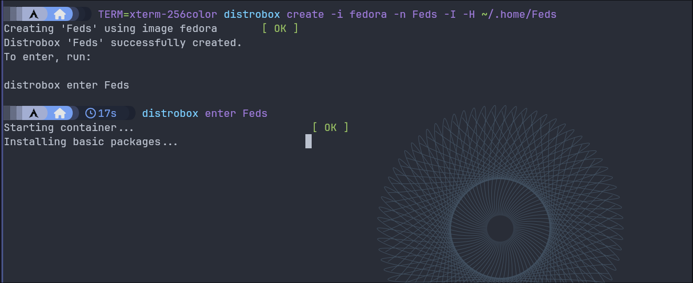
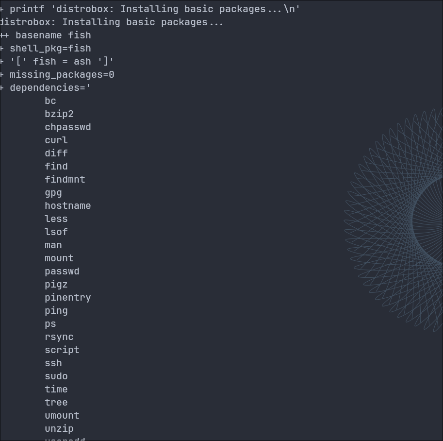
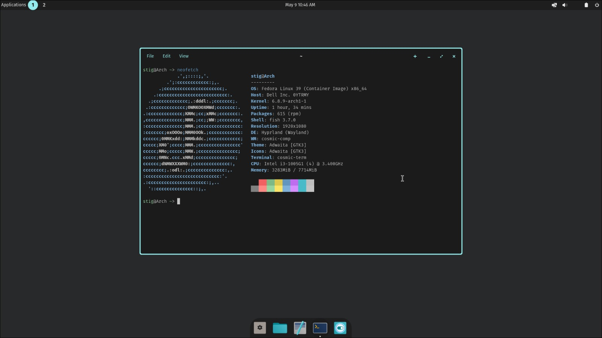

Hey there, tech enthusiasts! Ready to embark on a journey into the world of Distrobox? Strap in as we explore the ins and outs of this nifty tool. But first things first...

## What's the deal with Distrobox?

Ever wished you could test out different Linux distributions without committing to full-blown installations? Well, Distrobox grants you that wish! It's like having a box full of distros ready to play with, without the hassle of setting up multiple virtual machines or partitioning your hard drive.

## Wrangling with Podman

Now, you might wonder, "What's Podman got to do with all this?" Simply put, Podman is our trusty sidekick in this adventure. It helps us manage containers effortlessly, making our Distrobox experience smoother than a fresh jar of peanut butter.

## Let's get cooking: Installing `distrobox` and `podman`

Enough chit-chat, let's roll up our sleeves and get down to business. Installing Distrobox and Podman is as easy as pie. Just fire up your terminal and follow along:

```bash
$ sudo apt-get install distrobox podman  # For Debian/Ubuntu
```

```bash
$ sudo yum install distrobox podman      # For CentOS/RHEL
```

```bash
$ sudo dnf install distrobox podman      # For Fedora
```

For other distros, check out the official documentation for installation instructions. Once that's done, you're all set to dive into the container wonderland!

On *my* Arch install, I'd do this a little differently via a shell script that I have:
```bash
#!/usr/bin/env zsh
if [[ "$1" == "clean" || "$1" == "cleanup" || "$1" == "--clean" || "$1" == "-c" || "$1" == "--cleanup" ]]; then
  sudo rm -rf ~/.config/containers/ ~/.local/share/containers/ ~/.cache/containers/ ~/.Podman/ ~/.local/share/icons/distrobox /var/lib/containers /var/tmp/podman-static/1000/containers ~/.local/share/podman-static
  echo "Cleaned up container data"

else
  # stuff is stored in ~/.config/containers and ~/.local/share/containers
  mkdir -p ~/.Podman/bin/
  mkdir -p ~/.home/ # the home directory
  sudo chown -R stig:stig /home/stig/.home/ # fix permission issues inside containers
  # Install distrobox and bundled podman

  # Distrobox
  curl -s https://raw.githubusercontent.com/89luca89/distrobox/main/install | sh -s -- --prefix ~/.Podman
  curl -s https://raw.githubusercontent.com/89luca89/distrobox/main/distrobox --output ~/.Podman/bin/distrobox
  # Podman
  # curl -s https://raw.githubusercontent.com/89luca89/distrobox/main/extras/install-podman | sh -s -- --prefix ~/.Podman
  curl -fsSL https://github.com/89luca89/podman-launcher/releases/latest/download/podman-launcher-amd64 -o ~/.Podman/bin/podman
  curl -fsSL https://github.com/89luca89/lilipod/releases/latest/download/lilipod-linux-amd64 -o ~/.Podman/bin/lilipod
  chmod +x ~/.Podman/bin/{podman,lilipod}

  # use better Arch and Ubuntu images. These images are bigger, but don't take much time to build on using Distrobox
  mkdir -p ~/.cache/containers/
  rm -rf ~/.cache/containers/**
  ln -sf ~/.dotfiles/containers/short-name-aliases.conf  ~/.cache/containers/
  
  # Podman-compose
  sudo pacman -S python-dotenv --needed --noconfirm
  curl -o ~/.Podman/bin/podman-compose https://raw.githubusercontent.com/containers/podman-compose/main/podman_compose.py
  chmod +x ~/.Podman/bin/podman-compose
  # Conmon
  export cwd=$PWD
  cd ~/.Podman/podman/bin/
  wget "https://github.com/containers/conmon/releases/download/2.1.7/conmon.amd64" -o "conmon"
  chmod +x ./conmon
  cd $cwd


  # NOTE: `fuse-overlayfs` is required for rootful containers to work
  sudo -E mkdir -p /etc/containers
  sudo -E cp -f ~/.dotfiles/misc/policy.json  /etc/containers/
  # IGNORE THE cp ERROR

  # for GUI apps to work
  xhost +si:localuser:$USER &> /dev/null # who needs this output
  # sudo ln -sf ~/.Podman/bin/** /usr/local/bin
  echo "ADD 'export TERM=xterm-256color' IN ~/.Podman/bin/* FOR DISTROBOX TO WORK CORRECTLY -> ESP FOR THE DISTROBOX SCRIPT"
fi
```
Here are the contents of my `policy.json` file:
```json
{
    "default": [
        {
            "type": "insecureAcceptAnything"
        }
    ],
    "transports": {
        "docker": {
            "docker.io/library/hello-world": [
                {
                    "type": "reject"
                }
            ],
            "registry.access.redhat.com": [
                {
                    "keyType": "GPGKeys",
                    "type": "signedBy",
                    "keyData": "VGhlIGZvbGxvd2luZyBwdWJsaWMga2V5IGNhbiBiZSB1c2VkIHRvIHZlcmlmeSBSUE0gcGFja2FnZXMgYnVpbHQgYW5kCnNpZ25lZCBieSBSZWQgSGF0LCBJbmMuICBUaGlzIGtleSBpcyB1c2VkIGZvciBwYWNrYWdlcyBpbiBSZWQgSGF0CnByb2R1Y3RzIHNoaXBwZWQgYWZ0ZXIgTm92ZW1iZXIgMjAwOSwgYW5kIGZvciBhbGwgdXBkYXRlcyB0byB0aG9zZQpwcm9kdWN0cy4KClF1ZXN0aW9ucyBhYm91dCB0aGlzIGtleSBzaG91bGQgYmUgc2VudCB0byBzZWN1cml0eUByZWRoYXQuY29tLgoKcHViICA0MDk2Ui9GRDQzMUQ1MSAyMDA5LTEwLTIyIFJlZCBIYXQsIEluYy4gKHJlbGVhc2Uga2V5IDIpIDxzZWN1cml0eUByZWRoYXQuY29tPgoKLS0tLS1CRUdJTiBQR1AgUFVCTElDIEtFWSBCTE9DSy0tLS0tClZlcnNpb246IEdudVBHIHYxLjIuNiAoR05VL0xpbnV4KQoKbVFJTkJFcmdTVHNCRUFDaDJBNGIwTzl0K3Z6QzlWclZ0TDFBS3ZVV2k5T1BDamt2UjdYZDhEdEp4ZWVNWjVlRgowSHR6SUc1OHFEUnlid1VlODlGWnByQjFmZnVVS3pkRStIY0wzRmJOV1NTT1hWalpJZXJzZFh5SDNOdm5MTExGCjBETlJCMml4M2JYRzlSaC9SWHBGc054RHAyQ0VNZFV2YllDekU3OUsxRW5VVFZoMUwwT2YwMjNGdFBTWlhYMGMKdTdQYjVESTVsWDVZZW9YTzZSb29kcklHWUpzVkJRV25yV3c0eE5UY29uVWZOUGswRUdadEVuenZIMnp5UG9KaApYR0YrTmN1OVh3YmFsbllkZTEwT0N2U1dBWjV6VENwb0xNVHZRaldwYkNkV1hKekNtNkcrL2h4OXVwa2U1NDZICjVJanRZbTRkVElWVG5jM3d2RGlPRGdCS1J6T2w5ckVPQ0lnT3VHdER4UnhjUWtqckMreHZnNVZrcW43dkJVeVcKOXBIZWRPVStQb0YzREdPTStkcXYrZU5LQnZoOVlGOXVnRkFRQmtjRzd2aVpndkdFTUdHVXB6TmdON1huUzFnagovRFBvOW1aRVNPWW5LY2V2ZTJ0SUM4N3AyaHFqcnhPSHVJN2ZrWlllTkljQW9hODNyQmx0RlhhQkRZaFdBS1MxClBjWFMxLzdKelAwa3k3ZDBMNlhidS9JZjVrcVdRcEt3VUluWHR5U1JrdXJhVmZ1SzNCcGErWDFYZWNXaTI0SlkKSFZ0bE5YMDI1eHgxZXdWekdOQ1RsV24xc2tRTjJPT29RVFY0QzgvcUZwVFc2RFRXWXVyZDQrZkUwT0pGSlpRRgpidWhmWFl3bVJsVk9nTjVpNzdOVElKWkpRZllGajM4Yy9JdjV2WkJQb2tPNm1mZnJPVHYzTUhXVmdRQVJBUUFCCnRETlNaV1FnU0dGMExDQkpibU11SUNoeVpXeGxZWE5sSUd0bGVTQXlLU0E4YzJWamRYSnBkSGxBY21Wa2FHRjAKTG1OdmJUNkpBallFRXdFQ0FDQUZBa3JnU1RzQ0d3TUdDd2tJQndNQ0JCVUNDQU1FRmdJREFRSWVBUUlYZ0FBSwpDUkFabmkrUi9VTWRVV3pwRC85czVTRlIvWkYzeWpZNVZMVUZMTVhJS1V6dE5OM29jNDVmeUxkVEkzK1VDbEtDCjJ0RXJ1ellqcU5IaHFBRVhhMnNOMWZNcnN1S2VjNjFMbDJOZnZKamtMS0R2Z1ZJaDdrTTdhc2xOWVZPUDZCVGYKQy9KSjcvdWZ6M1VabXlWaUgvV0RsK0FZZGdrM0pxQ0lPNXc1cnlyQzlJeUJ6WXYybTBIcVliV2ZwaFkzdUh3NQp1bjNuZExKY3U4K0JHUDVGK09OUUVHbCtEUkg1OElsOUpwM0h3YlJhN2R2a1BnRWhmRlIrMWhJK0J0dGEyQzdFCjAvMk5LekN4Wnc3THgzUEJSY1U5MllLeWFFaWhmeS9hUUtaQ0F1eWZLaU12c216cys0cG9JWDdJOU5RQ0pweUUKSUdmSU5vWjdWeHFId1JuL2Q1bXcyTVpUSmpielNmK1VtOVlKeUEwaUVFeUQ2cWpyaVdRUmJ1eHBRWG1sQUpiaAo4b2taNGdiVkZ2MUY4TXpLKzRSOFZ2V0owWHhndGlrU283MmZIandoYTdNQWpxRm5PcTZlbzZmRUMvNzVnM05MCkdodDVWZHBHdUhrMHZiZEVOSE1DOHdTOTllNXFYR05EdWVkM2hsVGF2RE1sRUFIbDM0cTJIOW5ha1RHUkY1S2kKSlVmTmgzRFZSR2hnOGNNSXRpMjFuamlSaDdneUZJMk9jY0FUWTdiQlNyNzlKaHVOd2VsSHV4THJDRnBZN1YyNQpPRmt0bDE1alpKYU14dVFCcVlkQmdTYXkyRzBVNkQxKzdWc1d1ZnB6ZC9BYngxL2Mzb2k5WmFKdlcyMmtBZ2dxCmR6ZEEyN1VVWWpXdng0Mnc5bWVuSndoLzBqZVFjVGVjSVVkMGQwckZjdy9jMXB2Z01NbC9RNzN5ektnS1l3PT0KPXpiSEUKLS0tLS1FTkQgUEdQIFBVQkxJQyBLRVkgQkxPQ0stLS0tLQpUaGUgZm9sbG93aW5nIHB1YmxpYyBrZXkgY2FuIGJlIHVzZWQgdG8gdmVyaWZ5IFJQTSBwYWNrYWdlcyBidWlsdCBhbmQKc2lnbmVkIGJ5IFJlZCBIYXQsIEluYy4gIFRoaXMga2V5IGlzIGEgc3VwcG9ydGluZyAoYXV4aWxpYXJ5KSBrZXkgZm9yClJlZCBIYXQgcHJvZHVjdHMgc2hpcHBlZCBhZnRlciBOb3ZlbWJlciAyMDA2IGFuZCBmb3IgYWxsIHVwZGF0ZXMgdG8KdGhvc2UgcHJvZHVjdHMuCgpRdWVzdGlvbnMgYWJvdXQgdGhpcyBrZXkgc2hvdWxkIGJlIHNlbnQgdG8gc2VjdXJpdHlAcmVkaGF0LmNvbS4KCi0tLS0tQkVHSU4gUEdQIFBVQkxJQyBLRVkgQkxPQ0stLS0tLQpWZXJzaW9uOiBHbnVQRyB2MS4yLjYgKEdOVS9MaW51eCkKCm1RR2lCRVZ3REdrUkJBQ3dQaFpJcHZrakk4d1Y5c0ZURG9xeVBMeDF1YjhTZC93K1l1STVPdm00OW12dkVRVlQKVkxnOEZnRTVKbFNUNTlBYnNMRHlWdFJhOUN4SXZONXN5QlZyV1dXdEh0RG5ueWxGQmNxRy9BNkozYkk0RTkvQQpVdFNMNVp4YmF2MCt1dFA2ZjN3T3B4UXJ4YytXSURWZ3B1cmRCS0FRM2Rzb2JHQnF5cGVYNkZYWjV3Q2dvdTZDCnlacEdJQnFvc0phRFdMek5lT2ZiLzcwRC8xdGhMa1F5aFczSko2Y0hDWUpITmZCU2h2YkxXQmY2UzIzMW1nbXUKTXlNbHQ4S21pcGM5Yncrc2FhQWtTa1ZzUS9aYmZqcldCN2U1a2JNcnVLTFZySCtuR2hhbWxIWVVHeUFQdHNQZwpVai9OVVNqNUJtckNzT2tNcG40M25nVExzc0U5TUxoU1BqMm5JSEdGdjlCK2lWTHZvbURkd25hQlJnUTFhSzh6Cno2TUFBLzQwNnlmNXlWSi9NbFRXczEvNjhWd0Rob3NjOUJ0VTFWNUlFME5YZ1pVQWZCSnp6ZlZ6ektRcTZ6SjIKZVpzTUxocjk2d2JzVzEzelVadDFpbmcrdWx3aDJlZTRtZXVKcTZoLzk3MUpzcEZZL1hCaGNmcTRxQ05xVmpzcQpTWm5Xb0dkQ082SjhDeFBJZW1EMklVSHpqb3l5ZUVqM1JWeWR1cDZwY1daQW1oemtLclF6VW1Wa0lFaGhkQ3dnClNXNWpMaUFvWVhWNGFXeHBZWEo1SUd0bGVTa2dQSE5sWTNWeWFYUjVRSEpsWkdoaGRDNWpiMjAraUY0RUV4RUMKQUI0RkFrVndER2tDR3dNR0N3a0lCd01DQXhVQ0F3TVdBZ0VDSGdFQ0Y0QUFDZ2tRUldpY2lDK21XT0MxclFDZwpvb05MQ0ZPek5QY3ZoZDlaYThDODAxSG1uc1lBbmlDdzN5enJDcXRqWW54RER4bHVmSDBGVlR3WAo9ZC9ibQotLS0tLUVORCBQR1AgUFVCTElDIEtFWSBCTE9DSy0tLS0tCg=="
                }
            ]
        }
    }
}
```

And here's my `short-name-aliases.conf`:
```ini
# COPY THIS FILE OVER TO ~/.cache/containers
## not .config/containers
[aliases]

"fedora"="registry.fedoraproject.org/fedora-toolbox:40"
# "fedora"="quay.io/toolbx-images/fedora-toolbox"
"ubuntu"="quay.io/toolbx/ubuntu-toolbox"
"archlinux"="quay.io/toolbx/arch-toolbox"
```


## Time to play: setting Up Containers

Creating your first Distrobox container is a breeze. Just pick your favorite distro and let Podman work its magic:

```bash
distrobox create -i arch -n ArchBTW -I -H ~/.home
```
Note that Fedora - and some other distros such as Gentoo - may need additional setup:
```bash
distrobox create -i fedora:rawhide -n fedora -H ~/.home -I --additional-packages "systemd"
```

- I've used `-H ~/.home` because I'm setting a custom home directory. I wanna keep my home clean!
- `-I` isolates the `init` system. `systemd` works inside the container.

Replace `arch` with your desired distro image, and voila! You're now inside your cozy little container, ready to tinker to your heart's content. Of course, you're not limited to these images.
> I've chosen these images specifically because they take lesser time to set up on distrobox - more software - such as the X server - preinstalled.

## Fun with Distrobox: Interesting Use Cases

Now that you're armed with Distrobox and Podman, the possibilities are endless! From testing software compatibility across different distros to creating lightweight development environments, let your imagination run wild.

Heck, I've even managed to get a full-fledged desktop - [COSMIC](https://github.com/pop-os/cosmic-epoch) - working on my setup. I used a Fedora container for this purpose - the [COPR package](https://copr.fedorainfracloud.org/coprs/ryanabx/cosmic-epoch/). 
## Setting up Cosmic on Fedora



**You can always check the podman output via** `podman logs -f <container name>` - `podman logs -f Feds` **in my case.**



- Create a Fedora distrobox container via:

`distrobox create -i fedora -n Feds -I -H ~/.home/Feds --additional-packages "systemd"`
- Enter the container via `distrobox enter Feds` (replace with the name of your container).
- Run this in the container to install the desktop (note that this is a third-party repository):
```bash
sudo dnf copr enable ryanabx/cosmic-epoch
sudo dnf install cosmic-desktop
```

Because I'm launching the desktop via a TTY, I need to run `DISPLAY=:1 dbus-launch cosmic-session`. I'd installed the `dbus-x11` package on Fedora for this.
I'm quite pleased with the output:



That's all for now, folks! Hope you enjoyed this dive into the world of Distrobox. Until next time, happy containerizing! 🐳🎉
