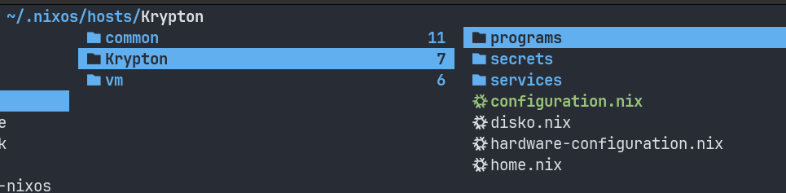

# NixOS returns with a bang!
I've returned to NixOS, and it's been quite a journey! After going back to  Arch for nearly 2 years, I’ve come back to it with renewed enthusiasm. Here's what I’ve been up to and why I made the switch.
I'd last used NixOS back [in 2023](https://zstg.is-a.dev/linux/nixos-part-1/).

## Why did i move from Arch?

I had been using Arch Linux for a while and, while I was comfortable with it, I felt the urge for a change. Arch served me well, but I wanted to give NixOS a try again - without losing any data. Thankfully, I retained my home partition, so I could make the transition to NixOS without any risk of losing my files. Everything stayed intact.

## The NixOS experience

### Flakes

Flakes have been a game-changer for me. They’re a fantastic addition to NixOS, allowing for more reliable and reproducible configurations. I’m glad I’ve started using them because they make managing packages and system configurations more enjoyable and <u>completely reproducible</u>. The Nix ecosystem as a whole seems to have become more polished than last time, and this drove me to take the plunge.

### Home-Manager

I had already played with Home-Manager during my previous attempt with NixOS, and I found it to be one of the most useful tools in the NixOS ecosystem. If you’re unfamiliar with it, Home-Manager allows you to manage user-level configurations declaratively, similar to how NixOS manages system configurations. It’s great for setting up things like Emacs, tmux, dotfiles, and other personal configurations, and it can, among a _host of other use cases_, work as a dotfiles manager like [GNU Stow](https://www.gnu.org/software/stow/).

## Emacs Build

Speaking of personal configurations, I’ve set up my Emacs environment to be just how I like it. Emacs is the cornerstone of my development setup, so getting it configured perfectly is essential. NixOS makes it easy to package and manage Emacs along with all its extensions and customizations.

I'm not going to show my Emacs config just yet, that's for another day. But I will tell you how to use my custom Emacs build.

```nix
{pkgs,...}: 
let
  modifiedEmacs = pkgs.emacs30-pgtk.overrideAttrs (oldAttrs: {
    configureFlags = oldAttrs.configureFlags ++ [
      "--with-gnutls"
      "--without-xwidgets"
      "--with-tree-sitter"
      "--with-png"
      "-with-jpeg"
      "--without-wide-int"
      "-with-sound"
      # "--without-native-compilation"
      # "--with-pgtk" # means lucid won't work
      # "-with-x-toolkit=lucid"
      "--with-libsystemd"
      "-with-dbus"
      "--with-pdumper=yes"
      "--without-pop"
      "-without-mailutils"
    ];
  });
in
modifiedEmacs
```
This [package override](https://ryantm.github.io/nixpkgs/using/overrides/) will thus smartly rebuild the Emacs package from source whenever the NixOS package gets an update. Is this somewhat like what Portage does on Gentoo? Guess I'll know when I try it out!

I've also added mu4e somewhere in my configuration - I need a decent email client too ;).

## Tips for NixOS Newcomers

- One thing I recommend is modularizing your configuration as early as possible.

It's (obviously) convenient to keep the config in a single file (2 if you consider the autogenerated `hardware-configuration.nix` file), but this works well only for small configurations. I've had difficulties managing my configuration even when it was split across 7-8 files (yes, skill issue 🤧). 

But now I've managed to get a hold of things because I've split the config like this:




Note that the root directory here (i.e `~/.nixos`), contains my `flake.nix` file that automatically imports the appropriate `configuration.nix` files according to the hosts defined. 

I don't have multiple devices for now, so `Krypton` is the only host in active use (apart from the generic VM config of course). But this setup makes it trivial to add new hosts because common configuration goes into the `common/` folder.


NixOS has a steep learning curve, but by breaking your configuration into manageable pieces, you can stay organized and avoid overwhelming yourself.

Each module can be a small, self-contained piece that focuses on a specific task (e.g., configuring the system, managing the package manager, setting up user configurations, etc.). 

It’s a bit of upfront effort, but it’ll save you a **lot** of headaches down the road.


## Pain Points

Of course, NixOS isn’t without its challenges. One of the biggest pain points I faced was the issue with arbitrary binaries. I had a lot of trouble running certain binaries last time I tried NixOS, and it was frustrating. However, things have improved. Tools like [`nix-ld`](https://nixos.org/manual/nix/stable/command-ref/nix-ld.html) and [`distrobox`](https://github.com/89luca89/distrobox) have become much more reliable. The NixOS ecosystem has also grown significantly—repositories have expanded from around 80k packages to over 120k as of now. A lot of software is now available, and the number of flakes (the pre-configured, reusable configurations I've mentioned above) has increased as well.

That said, some software may still not be packaged, but that’s not a huge deal. When that happens, I just use `distrobox` to run a containerized version of the software, which has been a solid workaround.

Another important pitfall is that the `Nix` language isn't very straightforward. **The documentation is severely lacking** - but this issue <u>permeates across a good part of the Nix ecosystem</u> anyways. For those not used to functional programming, the language might seem like an uglier JSON.

## Final Thoughts

In the end, returning to NixOS has been an exciting experience. It's not perfect, but it's certainly a great option for those who enjoy fine-tuning their system. I’m happy with my decision, and I look forward to exploring NixOS even further.
